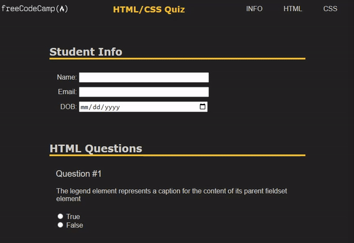

# HTML CSS Quiz (accessibility)
A font-end quiz webpage enabling user keyboard shortcuts, ARIA attributes, and design best practices for accessibility for those with disabilities to have the same opportunities as others.

## Demo
